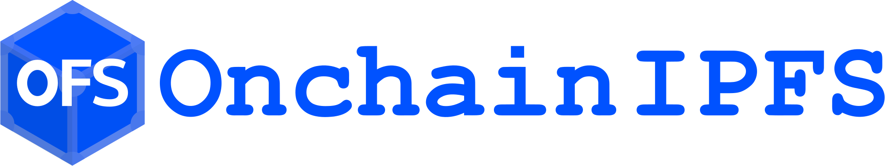

# 

Make your files permanent by storing them onchain. Store files referenced by Ethereum L1, on L2! A 100% Ethereum-aligned alternative to Arweave. Helps Arweave itself to be linked to an IPFS CID. Currently, Filecoin and Arweave (two non-Ethereum L1s) are the only way to store NFT metadata and other IPFS files' contents onchain. On Arweave, it is harder to obtain the file content for those used to IPFS. Onchain IPFS come to solve both issues: onchain storage (using the Ethereum-aligned L2 Base) and linking: CID<->Arweave TXID<->Torrent URI.

This project has two main folders:

```bash
.
├── contracts
│   ├── src
│   ├── broadcast
│   ├── script
│   └── test
└── web
    ├── app
    └── src
```

[contracts](/contracts/README.md) folder contains all the solidity code

[web](/web/README.md) folder contains all the frontend code
